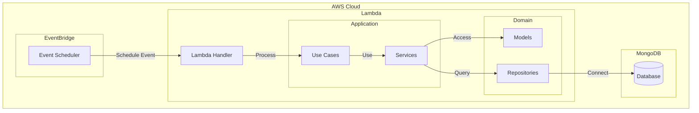
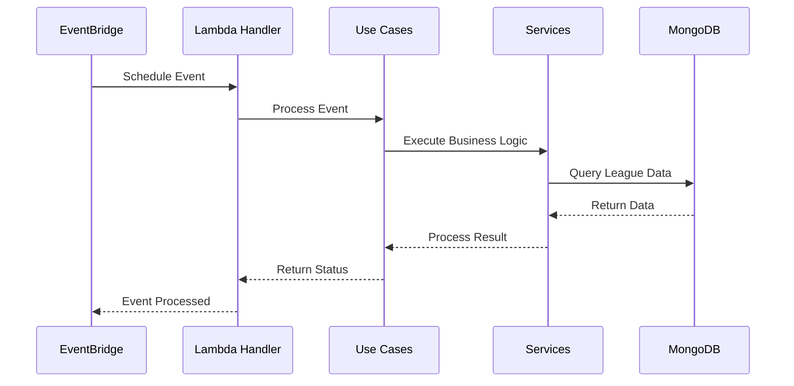

# Architecture

## Overview
The League Create Teams Scheduler is a serverless service that uses AWS Lambda and EventBridge to schedule and trigger team creation events in leagues. The service follows a clean architecture pattern with clear separation of concerns.

## Architecture Diagram

## Sequence Diagram

## System Layers

### Event Layer
- AWS EventBridge for event scheduling
- Event validation and processing
- Error handling and retries

### Application Layer
- Use cases for business logic
- Service orchestration
- Event processing flow

### Domain Layer
- Business models and entities
- Repository interfaces
- Domain rules and validations

### Infrastructure Layer
- MongoDB connection and queries
- AWS service integrations
- External service communication

## Data Flow
1. EventBridge triggers scheduled event
2. Lambda handler processes the event
3. Use cases execute business logic
4. Services interact with repositories
5. Data is queried from MongoDB
6. Results are processed and returned

## Security Considerations
- IAM roles for AWS services
- MongoDB connection security
- Environment variable encryption
- Event validation and sanitization

## Scalability
- Serverless architecture for automatic scaling
- Event-driven processing
- Asynchronous operations
- Connection pooling for MongoDB 